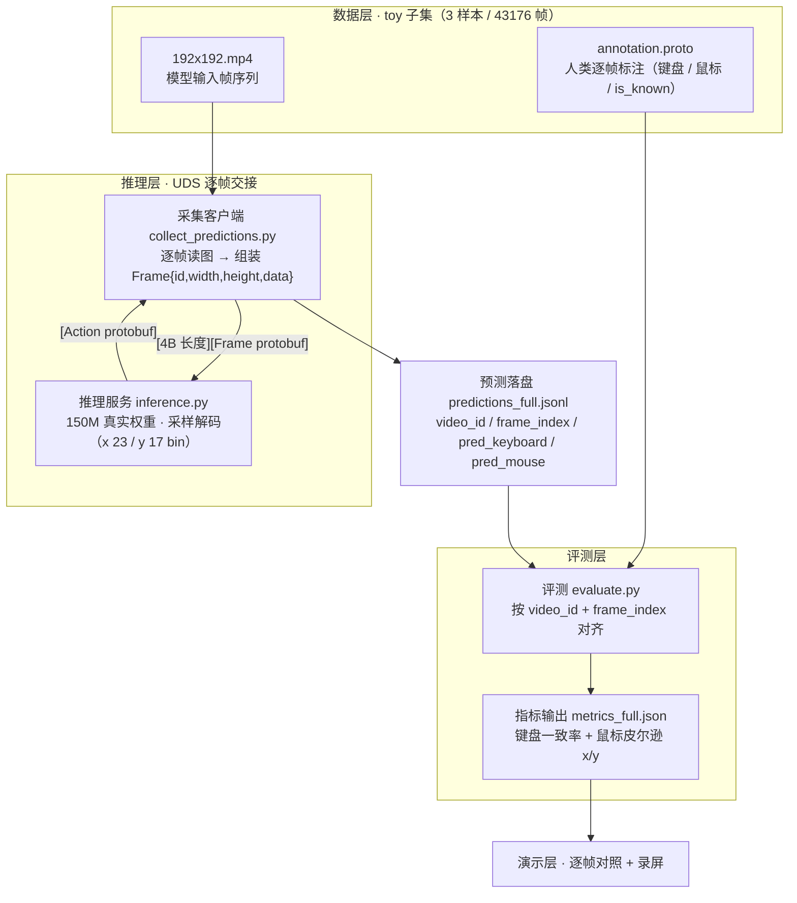
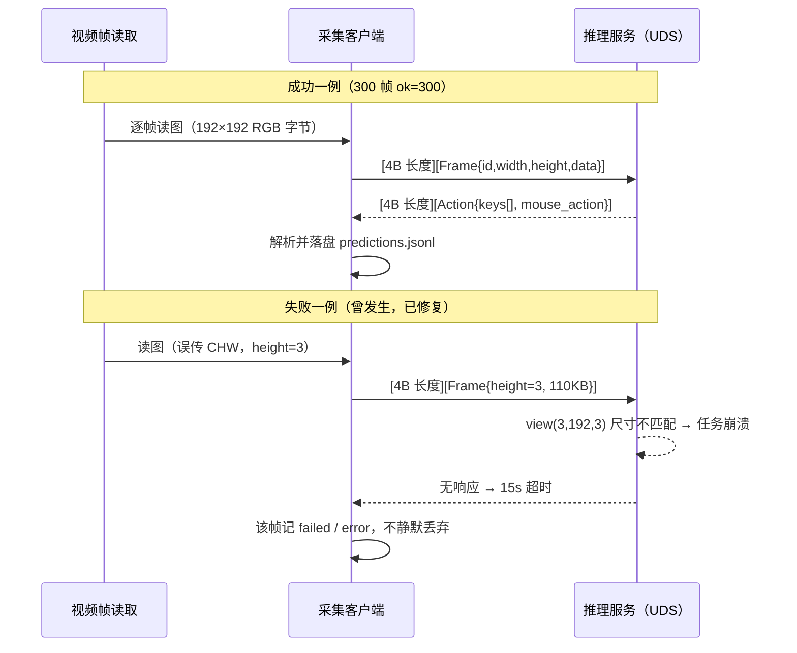

# 第 3 日实验报告——数据与调用约定

## 基本信息

- **课题编号与名称**：腾讯 IEG 课题——行为克隆游戏智能体（研究对象为 Open P2P / Pixels2Play 模型）
- **完成方式与成员**：独立完成（1 人）；承担需求界定、方案设计、实现、测试与演示全流程
- **实验环境**：老师提供的 GPU 服务器（a100-1，Ubuntu 24.04 / NVIDIA A100 80GB，临时资源，仅用于推理与评测）
- **交付方式**：课内不演示真机，主路径以录屏 + 逐帧对照呈现

## 今日目标

按指导书 2.2 第 3 天节奏，确定主路径上的数据对象与步骤间交接约定：帧以什么格式进模型、动作以什么格式回传、预测与人类标注如何对齐评测；同时明确哪些环节暂用假实现代替、计划哪一天换成真实实现。所有约定以官方源码核实为准，写进接口约定文档并落地为可复现的采集、评测两条命令链。

## 主路径上的数据或对象

| 对象 | 用途 |
|------|------|
| `dataset/dataset/<uuid>/annotation.proto` | 人类逐帧标注（VideoAnnotation protobuf）：键盘 `keys`、鼠标 `delta/scroll/buttons`、`is_known`，评测参照标准 |
| `dataset/dataset/<uuid>/192x192.mp4` | 模型实际输入帧序列（服务端统一尺寸） |
| `Frame{id,width,height,data}` | 客户端→服务端请求对象，`data` 为 raw RGB HWC 字节 |
| `Action{keys[],mouse_action}` | 服务端→客户端响应对象：键名数组 + 鼠标位移/滚动/按键 |
| `predictions/*.jsonl` | 采集客户端落盘：`video_id/frame_index/frame_ts/pred_keyboard/pred_mouse/is_known/error`，评测输入 |
| `metrics/*.json` | 评测输出：整体 + 分视频指标（键盘一致率、鼠标皮尔逊 x/y） |

下图表示主路径上各数据对象的流转与步骤间交接：



*图 1 主路径数据流（Markdown 内嵌 Mermaid，GitHub / Typora / VS Code 可直接渲染）*

## 调用约定

**调用时序**（成功一例 / 失败一例）：



*图 2 调用约定时序（成功一例 / 失败一例）*

主路径最关键一步：**UDS 推理调用**（逐帧发 Frame、收 Action）。线协议 `[4B 小端长度][protobuf]`，socket 路径 `/tmp/uds.recap`；帧为 raw RGB（服务端自动 resize 192×192）。

**成功一例**（命令行 + 产物）：

```bash
.venv/bin/python scripts/collect_predictions.py \
  --dataset dataset --uds-path /tmp/uds.recap \
  --output predictions/predictions_smoke.jsonl \
  --max-videos 1 --frames 300
```

- 输入要点：每帧 192×192 RGB 字节 + 帧号；输出要点：`Action` 的 `keys`（20 类字符串枚举）、`mouse_delta_px`（解码后像素位移，x/y 各 23/17 bin 采样解码）。
- 实测结果：`videos=1, frames=300, ok=300, failed=0`，预测动作落盘 JSONL，与标注按 `video_id`+`frame_index` 对齐。

**失败一例**（与课题相关）：客户端曾把 torchvision 返回的 `(T,C,H,W)` 中通道数当高度写入 Frame（`height=3`），与真实 110KB 数据不匹配 → 服务端 `view` 崩溃、该帧处理超时 → 客户端 15s 超时记为 failed。修复：读帧后统一转 HWC（`permute(0,2,3,1)`），一次解决。教训：帧尺寸与数据字节数必须自检一致，超时帧会以 `error` 字段落盘而非静默丢弃。

## 临时假实现

> 主路径上暂用假实现或本地样例代替的外部依赖，逐条标注状态与替换计划。**凡未标"已完成"的条目一律视为未完成**，不得当作已实现。

| 环节 | 暂用实现 | 状态与替换计划 |
|------|----------|----------------|
| 推理权重 | `--use_random_weights`（随机权重）：100 帧冒烟 + 样本 1 全量基线 | ✅ **已完成**：第 3 日当天已切换 150M 真实权重（300 帧 `ok=300`，全量评测已启动）；随机基线仅作对照锚点保留 |
| 文本 tokenizer | 官方 Gemma tokenizer（需在线拉取 gated 权重）在服务器无法加载，改用 null tokenizer（零文本嵌入） | ⏳ **暂用假实现，未完成**：纯视觉主线不依赖文本输入；仅在扩展 B（文本指令，`--input_text`）时需换真实 tokenizer，替换日期未定、不阻塞主线 |
| 数据源 | toy 子集 3 样本（官方样例） | ✅ **固定**：按课题红线主线只用 toy，不计划换全量数据 |
| 评测参照 | 直接使用官方 `annotation.proto` 真实标注 | ✅ **无假实现** |

## 项目备忘要点

- **技术栈**：uv 统一管理（Python 3.13.2 / torch 2.9.1+cu128）；采集 = 自研 UDS 客户端；评测 = 按键一致率 + 鼠标皮尔逊。
- **约定索引**：接口约定文档已定稿（UDS 线协议、动作空间 23/17 bin、JSONL 字段），作为后续实现与演示的单一事实来源。
- **待决问题**：约 200 帧隔离测试集划分规则；全量评测最终指标汇总；逐帧对照录屏形式。

## 今日完成与自检

- **约定齐备**：帧格式、动作空间、JSONL 字段、评测口径均按官方源码核实并定稿；鼠标 y 为 17 bin（此前误写 16）已修正。
- **假实现边界已标明**：第 5 节逐条标注状态（已完成 / 暂用未完成 / 固定），随机权重→真实权重当日已切换；null tokenizer 明确标为"暂用假实现、未完成、仅文本指令扩展才需替换"，不会被误当已完成。
- **自检**：评测脚本用"预测=标注"的 43176 帧假数据冒烟通过（键盘 1.0、鼠标 r=1.0）；随机权重基线（键盘 0.0%、鼠标 r≈0）证明指标有区分度；真实权重全量评测后台运行中。

## 问题、计划与 AI 沟通

### 不成功的沟通

1. 助手曾凭印象假设官方推理脚本有 `--output` 直接出预测，实际是 UDS 服务。调整：要求"按源码核实"后再定接口，一次并行核实多个关键文件。
2. 助手早期给出的接口字段表过大、偏离主路径。调整：只要求写"主路径成功一例与失败一例"，才得到可用的约定。
3. 客户端 CHW 通道数当高度写入 Frame 导致服务端崩溃（torchvision 输出格式变化）。调整：读帧统一转 HWC，并让失败帧以 `error` 落盘。

### 比较有效的沟通

1. 把"要核实的事实 + 验收方式"写进提问（如鼠标 bin 数、UDS 线协议），得到可直接写入文档的确证结论。
2. 只要求"主路径成功一例与失败一例"，约定文档短而可用，没有堆砌完整库设计。
3. 最小 UDS 客户端（发假帧测响应）快速定位客户端↔服务端问题，比完整链路排障快一个数量级。

### 明日安排

1. 全量评测完成后汇总真实权重指标，与随机基线、官方参考对照，如实记录。
2. 划分约 200 帧隔离测试集并做重叠校验。
3. 制作逐帧对照材料与录屏（模型输出 vs 人类标注）。
4. 撰写第 4 日实验报告。
